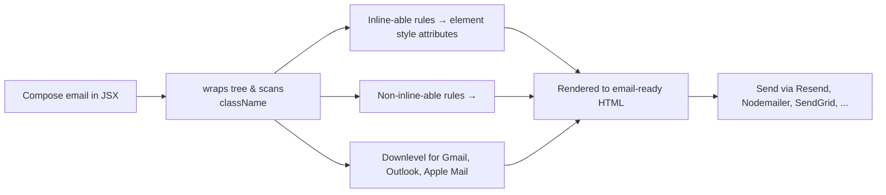
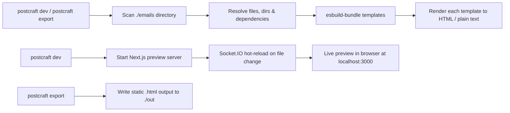
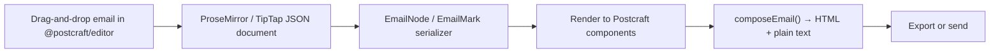
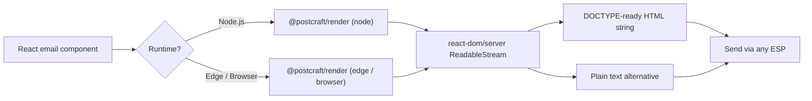
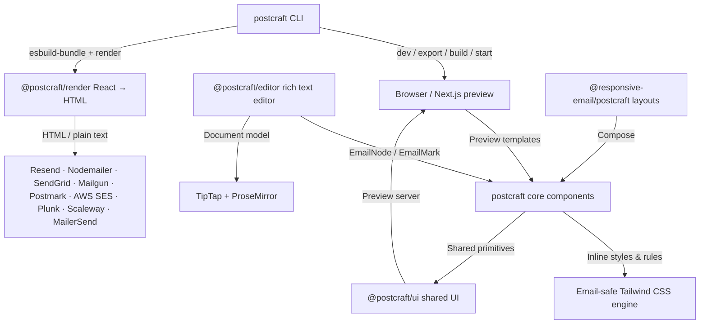

```
██████╗  ██████╗ ███████╗████████╗ ██████╗██████╗  █████╗ ███████╗████████╗
██╔══██╗██╔═══██╗██╔════╝╚══██╔══╝██╔════╝██╔══██╗██╔══██╗██╔════╝╚══██╔══╝
██████╔╝██║   ██║███████╗   ██║   ██║     ██████╔╝███████║█████╗     ██║
██╔═══╝ ██║   ██║╚════██║   ██║   ██║     ██╔══██╗██╔══██║██╔══╝     ██║
██║     ╚██████╔╝███████║   ██║   ╚██████╗██║  ██║██║  ██║██║        ██║
╚═╝      ╚═════╝ ╚══════╝   ╚═╝    ╚═════╝╚═╝  ╚═╝╚═╝  ╚═╝╚═╝        ╚═╝
```

<p>
  <a href="https://www.npmjs.com/package/postcraft">
    
  </a>
  
  
  
</p>

<div>
  <h3>🚀 The next generation of writing emails.</h3>
  <p>
    <b>Postcraft</b> is a collection of <b>high-quality, unstyled components</b> for creating
    beautiful, responsive emails with <b>React</b> and <b>TypeScript</b>.
  </p>
  <p>
    <a href="#features"><kbd>✨ Features</kbd></a>&nbsp;
    <a href="#tech-stack"><kbd>🧰 Tech Stack</kbd></a>&nbsp;
    <a href="#getting-started"><kbd>🚀 Getting Started</kbd></a>&nbsp;
    <a href="#packages"><kbd>📦 Packages</kbd></a>&nbsp;
    <a href="#visual-editor"><kbd>✍️ Editor</kbd></a>&nbsp;
    <a href="#integrations"><kbd>🔌 Integrations</kbd></a>&nbsp;
    <a href="#cli"><kbd>🛠️ CLI</kbd></a>
  </p>
</div>

[](https://www.npmjs.com/package/postcraft)
[](https://www.npmjs.com/package/postcraft)
[](LICENSE.md)
[](CONTRIBUTING.md)
[](https://github.com/GiorgiKavtaradze-prog/postcraft/stargazers)

---

## ✨ Overview

<div>
  <table>
    <tr>
      <td align="left">
        <b>Postcraft</b> is a collection of high-quality, unstyled components for creating beautiful
        email templates using <b>React</b> and <b>TypeScript</b>. We handle inconsistencies across
        <b>Gmail</b>, <b>Apple Mail</b>, <b>Outlook</b>, and other email clients — so you can focus on content.
      </td>
    </tr>
  </table>
</div>

> 💡 **Why Postcraft?** We believe email is an extremely important communication medium. It's time to stop developing emails like it's 2010 and rethink how email can be done in 2026 and beyond.

### ✨ Feature Matrix

<div>
<table>
  <tr>
    <td align="center" width="25%"><b>🧱</b><br/><b>Component-based</b><br/><small>Reusable React<br/>components</small></td>
    <td align="center" width="25%"><b>🎨</b><br/><b>Tailwind CSS</b><br/><small>Email-safe utility<br/>presets</small></td>
    <td align="center" width="25%"><b>📱</b><br/><b>Responsive</b><br/><small>Works on every<br/>screen size</small></td>
    <td align="center" width="25%"><b>🌙</b><br/><b>Dark mode aware</b><br/><small>Automatic theme<br/>handling</small></td>
  </tr>
  <tr>
    <td align="center" width="25%"><b>✍️</b><br/><b>Visual Editor</b><br/><small>Drag-and-drop<br/>@postcraft/editor</small></td>
    <td align="center" width="25%"><b>🔌</b><br/><b>Provider Ready</b><br/><small>Resend, Nodemailer,<br/>SendGrid, & more</small></td>
    <td align="center" width="25%"><b>🧪</b><br/><b>Fully Typed</b><br/><small>First-class<br/>TypeScript support</small></td>
    <td align="center" width="25%"><b>🚀</b><br/><b>CLI Included</b><br/><small>postcraft dev /<br/>postcraft export</small></td>
  </tr>
</table>
</div>

---

## 🧰 Technologies

This monorepo is built with the following stack.

### Languages & runtime

<div>
  <a href="https://www.typescriptlang.org/" title="TypeScript"></a>&nbsp;&nbsp;&nbsp;
  <a href="https://react.dev/" title="React"></a>&nbsp;&nbsp;&nbsp;
  <a href="https://nodejs.org/" title="Node.js"></a>
</div>

### Email & product libraries

<div>
  <a href="https://tailwindcss.com/" title="Tailwind CSS"></a>&nbsp;&nbsp;&nbsp;
  <a href="https://tiptap.dev/" title="TipTap"></a>&nbsp;&nbsp;&nbsp;
  <a href="https://prosemirror.net/" title="ProseMirror"></a>&nbsp;&nbsp;&nbsp;
  <a href="https://www.radix-ui.com/" title="Radix UI"></a>&nbsp;&nbsp;&nbsp;
  <a href="https://socket.io/" title="Socket.IO"></a>&nbsp;&nbsp;&nbsp;
  <a href="https://esbuild.github.io/" title="esbuild"></a>&nbsp;&nbsp;&nbsp;
  <a href="https://babeljs.io/" title="Babel"></a>
</div>

### Apps & sites

<div>
  <a href="https://nextjs.org/" title="Next.js"></a>&nbsp;&nbsp;&nbsp;
  <a href="https://mintlify.com/" title="Mintlify"></a>&nbsp;&nbsp;&nbsp;
  <a href="https://www.framer.com/motion/" title="Framer Motion"></a>&nbsp;&nbsp;&nbsp;
  <a href="https://threejs.org/" title="Three.js"></a>&nbsp;&nbsp;&nbsp;
  <a href="https://r3f.docs.pmnd.rs/" title="React Three Fiber"></a>&nbsp;&nbsp;&nbsp;
  <a href="https://supabase.com/" title="Supabase"></a>&nbsp;&nbsp;&nbsp;
  <a href="https://resend.com/" title="Resend"></a>&nbsp;&nbsp;&nbsp;
  <a href="https://zod.dev/" title="Zod"></a>&nbsp;&nbsp;&nbsp;
  <a href="https://lucide.dev/" title="Lucide"></a>
</div>

### Monorepo, build & quality

<div>
  <a href="https://pnpm.io/" title="pnpm"></a>&nbsp;&nbsp;&nbsp;
  <a href="https://turbo.build/" title="Turborepo"></a>&nbsp;&nbsp;&nbsp;
  <a href="https://vite.dev/" title="Vite"></a>&nbsp;&nbsp;&nbsp;
  <a href="https://biomejs.dev/" title="Biome"></a>&nbsp;&nbsp;&nbsp;
  <a href="https://vitest.dev/" title="Vitest"></a>&nbsp;&nbsp;&nbsp;
  <a href="https://playwright.dev/" title="Playwright"></a>&nbsp;&nbsp;&nbsp;
  <a href="https://testing-library.com/" title="Testing Library"></a>&nbsp;&nbsp;&nbsp;
  <a href="https://github.com/features/actions" title="GitHub Actions"></a>
</div>

> 💡 All logos above are the **official brand marks** of each respective project. Hover over any icon to see the technology name.

---

## 📦 Packages

This monorepo is organized into the following packages:

| Package                                                              | Version                                                                                                                                         | Description                                          |
| -------------------------------------------------------------------- | ----------------------------------------------------------------------------------------------------------------------------------------------- | ---------------------------------------------------- |
| [`postcraft`](packages/postcraft)                                    | [](https://www.npmjs.com/package/postcraft)                                     | Core React components for building email templates   |
| [`@postcraft/render`](packages/render)                               | [](https://www.npmjs.com/package/@postcraft/render)                     | Transform React components into HTML email templates |
| [`@postcraft/editor`](packages/editor)                               | [](https://www.npmjs.com/package/@postcraft/editor)                     | Rich text editor built on Tiptap & ProseMirror       |
| [`create-postcraft`](packages/create-email)                          | [](https://www.npmjs.com/package/create-postcraft)                       | Scaffold a new Postcraft project in seconds          |
| [`@postcraft/ui`](packages/ui)                                       | [](https://www.npmjs.com/package/@postcraft/ui)                             | Shared UI components used across the monorepo        |
| [`@responsive-email/postcraft`](packages/responsive-email-postcraft) | [](https://www.npmjs.com/package/@responsive-email/postcraft) | Responsive email layout components                   |

---

## � How It Works

### Component Authoring Flow



### CLI Preview & Export Flow



### Visual Editor Flow



### Dual Runtime Rendering Flow



### Monorepo Architecture Overview



---

## 🚀 Getting Started

### Prerequisites

- **Node.js** `>= 20.0.0`
- **pnpm** `>= 11.0.0` (or npm / yarn / bun)

### Quick Start

Scaffold a new project in seconds:

```sh
npx create-postcraft@latest
cd my-email-project
npm install
npm run dev
```

The dev server starts at `http://localhost:3000` with a live preview interface for your email templates.

### Manual Installation

Add Postcraft to an existing project:

```sh
npm install postcraft
# or
pnpm add postcraft
# or
yarn add postcraft
```

### Your First Email

```tsx
import {
  Html,
  Head,
  Body,
  Container,
  Heading,
  Text,
  Button,
  Preview,
  Tailwind,
  pixelBasedPreset,
} from "postcraft";

interface WelcomeEmailProps {
  name: string;
  verificationUrl: string;
}

const tailwindConfig = {
  presets: [pixelBasedPreset],
};

export default function WelcomeEmail({
  name,
  verificationUrl,
}: WelcomeEmailProps) {
  return (
    <Html lang="en">
      <Tailwind config={tailwindConfig}>
        <Head />
        <Body className="bg-gray-100 font-sans">
          <Preview>Welcome to Postcraft — Verify your email</Preview>
          <Container className="max-w-xl mx-auto p-8">
            <Heading className="text-2xl font-bold text-gray-900">
              Welcome, {name}!
            </Heading>
            <Text className="text-base text-gray-600 mt-4">
              Thanks for signing up. Please verify your email address to get
              started.
            </Text>
            <Button
              href={verificationUrl}
              className="bg-blue-600 text-white px-6 py-3 rounded-md block text-center no-underline box-border mt-6"
            >
              Verify Email Address
            </Button>
          </Container>
        </Body>
      </Tailwind>
    </Html>
  );
}

WelcomeEmail.PreviewProps = {
  name: "Giorgi",
  verificationUrl: "https://postcraft.dev/verify/abc123",
} satisfies WelcomeEmailProps;
```

### Rendering to HTML

Convert your React email component to an HTML string ready for sending:

```tsx
import { render } from "@postcraft/render";
import { WelcomeEmail } from "./emails/welcome";

const html = await render(
  <WelcomeEmail name="Giorgi" verificationUrl="https://example.com/verify" />,
);
const text = await render(
  <WelcomeEmail name="Giorgi" verificationUrl="https://example.com/verify" />,
  { plainText: true },
);
```

---

## 🧩 Components

A set of standard, cross-client compatible components to help you build beautiful emails without dealing with table-based layouts.

### Layout

| Component                                                  | Description                                  |
| ---------------------------------------------------------- | -------------------------------------------- |
| [`Html`](packages/postcraft/src/components/html)           | Root HTML wrapper with `lang` attribute      |
| [`Head`](packages/postcraft/src/components/head)           | Email head element for meta, styles, fonts   |
| [`Body`](packages/postcraft/src/components/body)           | Main body wrapper                            |
| [`Container`](packages/postcraft/src/components/container) | Centered content wrapper (max-width: 37.5em) |
| [`Section`](packages/postcraft/src/components/section)     | Interior content block for grouping          |
| [`Row`](packages/postcraft/src/components/row)             | Horizontal row for multi-column layouts      |
| [`Column`](packages/postcraft/src/components/column)       | Column within a Row                          |

### Content

| Component                                              | Description                               |
| ------------------------------------------------------ | ----------------------------------------- |
| [`Preview`](packages/postcraft/src/components/preview) | Inbox preview text (always first in Body) |
| [`Heading`](packages/postcraft/src/components/heading) | h1–h6 heading elements                    |
| [`Text`](packages/postcraft/src/components/text)       | Paragraph text blocks                     |
| [`Button`](packages/postcraft/src/components/button)   | Styled call-to-action link button         |
| [`Link`](packages/postcraft/src/components/link)       | Inline hyperlinks                         |
| [`Img`](packages/postcraft/src/components/img)         | Responsive image component                |
| [`Hr`](packages/postcraft/src/components/hr)           | Horizontal divider                        |

### Specialized

| Component                                                     | Description                       |
| ------------------------------------------------------------- | --------------------------------- |
| [`Tailwind`](packages/postcraft/src/components/tailwind)      | Tailwind CSS support for emails   |
| [`Font`](packages/postcraft/src/components/font)              | Custom web font loading           |
| [`Markdown`](packages/postcraft/src/components/markdown)      | Render Markdown content in emails |
| [`CodeBlock`](packages/postcraft/src/components/code-block)   | Syntax-highlighted code blocks    |
| [`CodeInline`](packages/postcraft/src/components/code-inline) | Inline code formatting            |

---

## ✍️ Visual Editor

Postcraft provides a **rich text email editor** built on [TipTap](https://tiptap.dev/) and [ProseMirror](https://prosemirror.net/). It serializes content to Postcraft components and exports email-ready HTML and plain text.

### Features

| Feature               | Description                                                 |
| --------------------- | ----------------------------------------------------------- |
| 🧠 **Bubble Menu**    | Contextual formatting toolbar on selection                  |
| 🎛️ **Inspector**      | Property editing panel for selected elements                |
| ⚡ **Slash Commands** | Type `/` to quickly insert elements                         |
| 🎨 **Theming**        | Built-in themes (`basic`, `minimal`) with CSS customization |
| 📐 **Column Layouts** | Drag-and-drop multi-column email structures                 |
| 🔗 **Link Editing**   | Inline link management                                      |
| 📤 **Email Export**   | `composeEmail()` to export email-ready HTML                 |
| 🖼️ **Image Upload**   | Built-in image upload support                               |

### Installation & Quick Start

```bash
npm install @postcraft/editor
```

```tsx
import { EmailEditor, type EmailEditorRef } from "@postcraft/editor";
import "@postcraft/editor/themes/default.css";
import { useRef } from "react";

export function MyEditor() {
  const ref = useRef<EmailEditorRef>(null);

  return (
    <EmailEditor
      ref={ref}
      content="<p>Start typing your email...</p>"
      theme="basic"
    />
  );
}
```

### Entry Points

| Import                         | Contents                                       |
| ------------------------------ | ---------------------------------------------- |
| `@postcraft/editor`            | Main `EmailEditor` component and top-level API |
| `@postcraft/editor/core`       | Serializer, types, and event bus               |
| `@postcraft/editor/extensions` | 35+ TipTap extensions for email elements       |
| `@postcraft/editor/ui`         | Bubble menus, slash command, inspector         |
| `@postcraft/editor/plugins`    | ProseMirror plugins                            |
| `@postcraft/editor/utils`      | Shared utilities                               |

---

## 🔌 Integrations

Emails built with Postcraft can be sent with any email service provider:

| Provider       | Example                                    |
| -------------- | ------------------------------------------ |
| **Resend**     | [examples/resend](examples/resend)         |
| **Nodemailer** | [examples/nodemailer](examples/nodemailer) |
| **SendGrid**   | [examples/sendgrid](examples/sendgrid)     |
| **MailerSend** | [examples/mailersend](examples/mailersend) |
| **Mailgun**    | [examples/mailgun](examples/mailgun)       |
| **Postmark**   | [examples/postmark](examples/postmark)     |
| **AWS SES**    | [examples/aws-ses](examples/aws-ses)       |
| **Plunk**      | [examples/plunk](examples/plunk)           |
| **Scaleway**   | [examples/scaleway](examples/scaleway)     |

**Example: Sending with Resend**

```tsx
import { Resend } from "resend";
import { WelcomeEmail } from "./emails/welcome";

const resend = new Resend(process.env.RESEND_API_KEY);

const { data, error } = await resend.emails.send({
  from: "Acme <onboarding@resend.dev>",
  to: ["user@example.com"],
  subject: "Welcome to Acme!",
  react: (
    <WelcomeEmail name="Giorgi" verificationUrl="https://example.com/verify" />
  ),
});
```

---

## 🛠️ CLI Reference

Postcraft ships with a powerful CLI to streamline your email development workflow.

| Command                                                              | Description                                                |
| -------------------------------------------------------------------- | ---------------------------------------------------------- |
| `postcraft dev`                                                      | Start live preview server (default: `./emails`, port 3000) |
| `postcraft dev --dir <path> --port <port>`                           | Start server with custom options                           |
| `postcraft export`                                                   | Export all templates to static HTML in `./out`             |
| `postcraft export --dir <path> --outDir <path> --pretty --plainText` | Export with options                                        |
| `postcraft build`                                                    | Build the preview app for production deployment            |
| `postcraft start`                                                    | Run the built preview app                                  |
| `postcraft resend setup`                                             | Connect CLI to Resend via API key                          |
| `postcraft resend reset`                                             | Remove stored Resend API key                               |

---

## 🏗️ Monorepo Structure

```
postcraft/
├── apps/
│   ├── demo/                    # Demo email templates showcase
│   ├── docs/                    # Documentation site (Mintlify)
│   └── web/                     # Marketing website (Next.js)
├── benchmarks/                  # Performance benchmarks
│   └── tailwind/
├── examples/                    # Email service provider integrations
│   ├── aws-ses/
│   ├── mailersend/
│   ├── mailgun/
│   ├── nodemailer/
│   ├── plunk/
│   ├── postmark/
│   ├── resend/
│   ├── scaleway/
│   └── sendgrid/
├── packages/
│   ├── create-email/            # Scaffolding CLI (npx create-postcraft)
│   ├── editor/                  # Rich text visual editor
│   ├── postcraft/               # Core email components & CLI
│   ├── render/                  # React → HTML renderer
│   ├── responsive-email-postcraft/  # Responsive email components
│   ├── tsconfig/                # Shared TypeScript configs
│   └── ui/                      # Shared UI components (preview server)
├── playground/                  # Interactive component playground
├── scripts/                     # Build & release automation scripts
└── skills/                      # AI agent skills for email development
    └── postcraft/
```

---

### Setting Up Your Environment

```sh
# Clone the repository
git clone https://github.com/GiorgiKavtaradze-prog/postcraft.git
cd postcraft

# Install all dependencies
pnpm install

# Build all packages
pnpm build

# Run all tests
pnpm test

# Run tests in watch mode
pnpm test:watch

# Lint the codebase
pnpm lint

# Auto-fix linting issues
pnpm lint:fix
```

### Linking the CLI Globally

To avoid rebuilding after every change when working on the CLI:

```sh
# Link the dev version globally
pnpm link ./dev -g

# Use it just like the regular CLI
postcraft-dev [command] [flags]
```

---

## 🤝 Contributing

We welcome contributions from the community! Please read our [Contributing Guide](CONTRIBUTING.md) before getting started.

- 🐛 **Found a bug?** [Open an issue](https://github.com/GiorgiKavtaradze-prog/postcraft/issues/new?template=bug_report.md)
- 💡 **Have an idea?** [Start a discussion](https://github.com/GiorgiKavtaradze-prog/postcraft/discussions)
- 🔧 **Want to contribute code?** Read our [Contributing Guide](CONTRIBUTING.md)

---

## 🛡️ Security

Please read our [Security Policy](SECURITY.md) to learn how to report security vulnerabilities responsibly.

---

## 📄 License

This project is licensed under the **MIT License** — see the [LICENSE.md](LICENSE.md) file for details.

---

<sub>Built with ❤️ by <a href="https://github.com/GiorgiKavtaradze-prog">Giorgi Kavtaradze</a> and the Postcraft community</sub>
